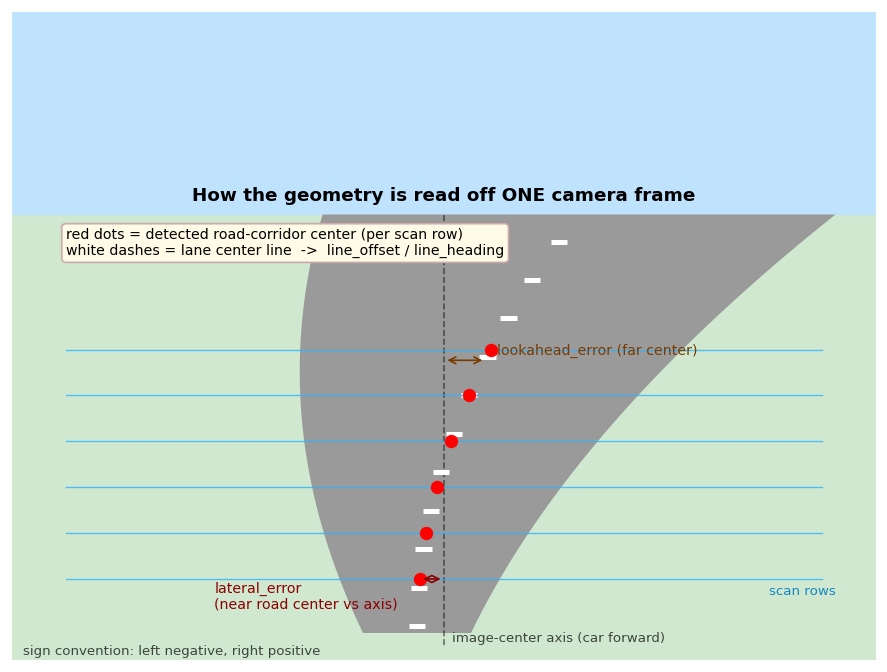
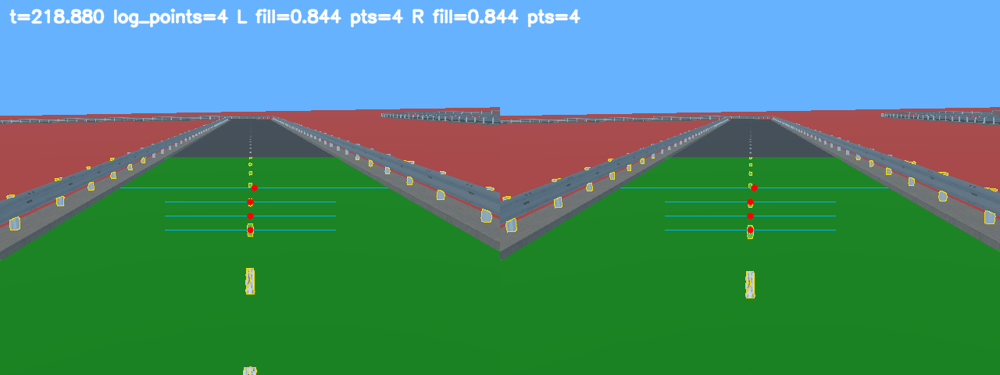
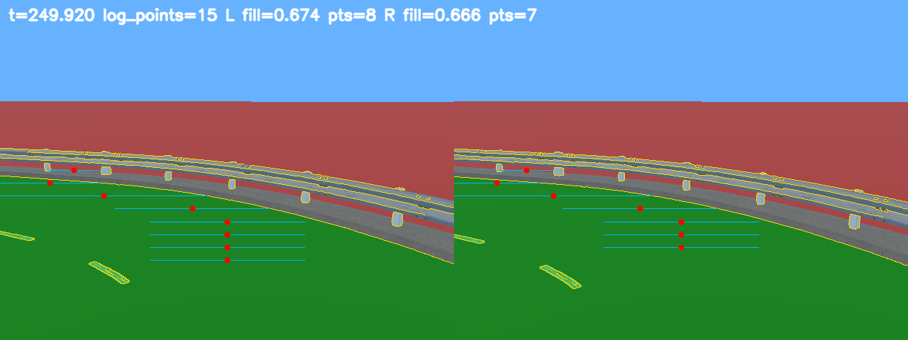

# AI Racer 控制器技术手册

本手册介绍这个控制器的**策略逻辑**：一帧画面传进来，怎么一步步变成方向盘和油门。面向第一次接触本策略的读者，讲设计与数据流，不讲调参过程。所有系数用**参数名**指代（具体数值在 `controller/params.py`）。

> **维护约定（给改这个仓库的人/AI）**：这是面向交付的"逻辑说明"，描述当前稳定的设计，**不记录每次调参或个别问题的修复过程**（那些写在 `experiments/notes.md` / `cases/`）。**不要每次改参数或策略就来改这份手册**，尤其不要在改动还没在 Webots 跑通时改它。只有当策略结构已稳定、且有人明确要求时，才更新本手册。

> **符号约定（全程一致）**：误差符号 **左负右正**；图像坐标按 OpenCV，`x` 向右、`y` 向下。模块间字段名是契约，定义在 `controller/common.py`。

---

## 0. 总览：四级流水线

平台每帧调用 `control(left_img, right_img, timestamp)`（双目 BGR 图 + 仿真时间），返回 `(steering, speed)`，`steering∈[-1,1]`、`speed∈[0,1]`。入口 `team_controller_local.py` 只做接线和异常兜底，算法分四级，每一级只读上一级的输出：

```
 left_img, right_img
        │
        ▼
 ① perception   →  PerceptionObs   "路在哪、白线在哪"（道路中心点、边界点、白线 offset/heading、置信度）
        ▼
 ② estimator    →  TrackState      "几何误差/方向/曲率"（lateral_error、lookahead_error、heading_error、curvature、line_*）
        ▼
 ③ policy       →  ControlCmd      "舵角和速度"
        ▼
 ④ clamp_cmd    →  (steering, speed)
```

---

## 1. 感知 perception：从画面到"路在哪、线在哪"

对**每个相机**独立做"分色块 → 沿扫描线追路 → 找白线"，再融合左右。参数在 `VISION_PROFILE` / `COLOR_PROFILE` / `LINE_FOLLOW_PROFILE`。

### 1.1 把画面分成颜色块（mask）

只看画面下半部分（`roi_top_ratio` 以下；上面是天空/远景）。颜色判别基于**从真实帧采样**的色卡 `COLOR_PROFILE`，每类存 HSV 和 Lab 两个颜色空间的中位数 + 容差，共 6 类：

| 颜色类 | 含义 |
|---|---|
| `road_asphalt_dark_gray` | 可行驶的深灰沥青路面（目标） |
| `curb_shoulder_light_gray` | 路肩/路牙（比路面亮） |
| `guardrail_light_gray` | 护栏（蓝灰） |
| `green_grass` / `red_ground` / `blue_sky` | 草地 / 红色场地 / 天空 |

**道路 mask**（`_build_masks`）：命中沥青色卡、且灰度与通道差落在沥青特征区间的像素构成 `road_core`；从中扣除草、红地、天空和偏亮的路肩；横跨赛道的蓝色 checkpoint 门（门后仍是路）按整行并入路面；最后形态学去碎、连缝。另外单独保留一张 Canny 边缘 mask，仅在道路 mask 失败时兜底。

副产物：`texture_score`（纹理）、`mask_fill_ratio`（路面占比），以及 `red_environment` 标志（红色场地占比是否超过 `red_world_min_ratio`，写入 `debug_flags`，供策略区分场景）。

### 1.2 沿扫描线追走廊 → 道路中心点

在 ROI 里布 `scan_count` 条水平扫描行，从近到远逐行（`_scan_image` / `_pick_segment`）：取道路 mask 在该行的连续区间（虚线/细缝切开的合并），按宽度过滤，过宽的截到上一条扫描中心附近的一小段；道路 mask 无区间时用边缘兜底；在候选里选**离上一条有效中心最近**的，跳变过大（`max_center_jump_ratio`）则丢弃。每行的走廊中点构成 `center_points`，端点构成左右边界点。

下面这张示意图说明一帧里各量怎么读出来——**红点是每条扫描行识别出的道路中心**：



实拍直道（红点基本在画面正中 → `lateral_error≈0`）：



### 1.3 中间白色虚线（line）—— 更可靠的"真实中心"参照

道路 mask 给的是"可行驶走廊中点"，弯道里它会偏；中间的**白色虚线**才是真正的车道中心参照，单独检测（`_camera_line_state`）：逐行找同时满足 ① 够亮（`white_min`）② 近中性白（色度 ≤ `white_chroma_max`，借此排除偏蓝灰的护栏支柱）③ 左右紧邻都是深灰路面（"白线躺在大片路面中间"，排除外侧是路牙/红地/草的护栏）的窄白段。

用最近 1/3 与最远 1/3 实测点的中位数算：`line_offset`（近处白线相对车中轴的归一化偏移，**正 = 线在车右侧 = 车偏在线左侧**）、`line_heading`（线往哪弯）、`line_confidence`（命中点数 / `confidence_full_points`）。双目都看到才给高置信；发车短窗口或红色场地允许受限的单目兜底。

实拍弯道（路面向左弯去，红点沿中心线追踪）：



### 1.4 左右融合 + 置信度

单相机置信度 `_score_scan` 综合有效扫描行占比、宽度/中心稳定性、纹理，并对"有效行少 / mask 太空或太满 / 用了边缘兜底"降权。融合 `_fuse_scans`：只一侧可用就用那侧；两侧冲突选高置信；两侧一致就合并。输出 **`PerceptionObs`**（中心点、左右边界点、道路宽度、置信度、`debug_flags`、`line_offset/heading/confidence`、`near_obstacle`）。

---

## 2. 几何估计 estimator：从点到"误差 / 方向 / 曲率"

把像素点变成策略能用的几个标量（`ESTIMATOR_PROFILE`）。

- **归一化**：中心点 `x` 归一化成 `x_norm = (x − image_center_x)/x_scale ∈ [−1,1]`；`y` 转成 progress（近=0、远=1）。
- **拟合中心线**：点够多用二次曲线，否则直线。
- **四个核心量**：

| 量 | 怎么算 | 含义 |
|---|---|---|
| `lateral_error` | 近端 band（`progress ≤ near_progress_max`）`x_norm` 中位数 | 近处横向误差（车相对近处道路中心偏左/右） |
| `lookahead_error` | 远端 band（`progress ≥ far_progress_min`）`x_norm` 中位数 | 远处预瞄误差（前方道路中心在哪） |
| `heading_error` | 拟合曲线在 `heading_eval_progress` 处的导数 × `heading_gain` | 道路方向（往哪弯） |
| `curvature` | 二次项系数 × `curvature_gain` × `curvature_trust` | 弯的急缓 |

`curvature_trust` 在扫描点少 / 跨度小 / 拟合差时把曲率收向 0（远处点稀疏时二次项是噪声）。另用边界点算近处两侧余量 `left_margin_near` / `right_margin_near`。

- **白线融入主链路**：先算信任权重 `line_trust`（白线置信 × 形态门 × road mask 质量），`line_trust>0` 时按权重把上面的 `lateral/heading/lookahead_error` 拉向白线目标。
- **置信度 / lost / 平滑**：`geometry_confidence` 低于 `lost_confidence` 判 lost（按 `lost_*_decay` 衰减保留上帧，不归零）；按置信度自适应平滑并限制单帧变化。输出 **`TrackState`**。

---

## 3. 控制策略 policy：从状态到舵角 / 速度

参数来自 `NO_OTHER_CARS_CONTROL`（兼容别名 `CONTROL` 仍保留）。当前实现的是无其他车策略；`with_other_cars` 只留命名入口，尚未实现。

### 3.1 风险分量

`_control_signals` 从 `TrackState` 拆出 `[0,1]` 风险：`curve_risk`（弯量）、`offset_risk`（横偏）、`confidence_risk`、`lost_risk`、`margin_risk`，再合成综合 `risk`。速度和模式共享。

### 3.2 驾驶状态机

`_select_mode` 在五态间切换（带进入/退出迟滞）：`lost`（丢线/低置信，保守滑行）、`recovering`（刚恢复的缓冲）、`hard_turn`（弯量高）、`correcting`（横偏大）、`cruise`（直道）。

### 3.3 目标舵角 `_target_steering`（核心）

舵角由**近处回中项**和**远处预瞄项**组成，再经门控：

```
center_term    = lateral_error × gain_lateral                      # 近处：回到当前道路中心
lookahead_term = lookahead_error×gain_lookahead
               + heading_error ×gain_heading
               + curvature     ×gain_curve                         # 远处：预瞄/入弯
```

**(a) 入弯时机门控（决定转弯半径的关键）。** 远处预瞄项是"切内线/半径偏小"的来源：直道接近弯口时远处的路已弯，预瞄项提前变大，会让车**还没到弯口就提前打轮、切进内侧**。门控用 `corner_arrival` 衡量"车是否已**物理到达**弯口"——只看近处 `lateral_error` 漂移（直道≈0，车沿直线开到弯口、真正开始偏离时才长起来），并随速度提前、进弯后保持：

```
arrival_ref     = turn_in_lateral_ref × (1 − turn_in_speed_comp × speed_norm)   # 越快越早开门
instant_arrival = clamp(|lateral_error| / arrival_ref, 0, 1)
# 进弯后 ratchet 保持峰值（弯中持续转），出弯按 hold_decay 迟滞收门
corner_arrival  = (hard_turn ? max(instant_arrival, latch)
                             : max(instant_arrival, latch × turn_in_hold_decay))
lookahead_term × = corner_arrival                                                # 未到弯口时远处项被压到≈0
```

要点：
- **判据只用近处 `lateral`**，不用远处弯量（`heading`/`curvature`）或瞬时弯急度——它们在接近段就大、会让门提前开（早切内）；弯的急缓在入弯瞬间也无法从尚未发育的视野里判别。
- 效果是 out-in-out：车先沿线进弯口、略外漂，漂移把 `lateral` 顶起来后再转。`turn_in_lateral_ref` 小=早转/半径小。
- **速度耦合**（`turn_in_speed_comp`）：过弯越快半径越大，高速时把参考收小、提前开门补偿。
- **保持 + 出弯迟滞**（`turn_in_hold_decay`）：`lateral` 在弯中会反复回落，若不保持，门会把远处项收掉 → 车转一半收轮、转不到位。进弯（`hard_turn`）后把门 ratchet 到峰值并保持；出弯再迟滞收轮。

**(b) 弯中减预瞄。** 即使时机对了，弯中若可信白线显示车已切到内侧（`line_offset` 与远处项反号），就按"白线证明的内侧程度 × 置信度"在源头成比例削弱远处预瞄项（`corner_relief_*`），并带迟滞保持，避免远处项和白线修正打成来回甩。只缩远处转向项，不动风险/速度。

**(c) 其余。** 近/远权重随风险调整、方向冲突时缩远处权重、少量非线性增益、按模式修正、deadzone、钳到 `±max_abs_steering`。

### 3.4 平滑、限速、脱困

- `_smooth_steering`：按模式 EMA 平滑 + 限变化率 + 高速收舵（高速下同样舵角半径更小）。
- `_target_speed`：以 `base_speed` 为底，**乘法**叠加弯道/横偏/置信/转向/边界余量降速因子；模式给上限；直道提速到 `straight_speed`；发车短时限速。`_smooth_speed` 让加速慢、减速快。
- `_escape_if_stalled`：顶住栏杆卡死时短暂朝感知到的路面一侧脱困（门槛严格，避免误触发）。

### 3.5 后置白线修正

最后在最终舵角上加一个**有界微调**（`max_correction` 钳制），让车身追向白线，**不进**风险/模式/速度/入弯门控。

```
final_steering = clamp(steering + line_correction, −1, 1)
```

---

## 4. 输出

`clamp_cmd` 把 `ControlCmd` 限到 `steering∈[−1,1]`、`speed∈[0,1]`。任何一级异常，入口层兜底返回 `(0.0, 0.0)`。

---

## 5. 速查

- **误差符号**：左负右正；图像 `x→右`、`y→下`。`line_offset` 正 = 白线在车右侧 = 车偏在线左侧。
- **转弯半径**由"入弯时机门控（3.3a）"主导：`corner_arrival` 只看近处 `lateral` 来判"弯到没"，主要旋钮是 `turn_in_lateral_ref`、`turn_in_speed_comp` 和 `turn_in_hold_decay`。
- **白线有两条链路**：可信白线会在 estimator 里进入主几何目标；policy 里还有一层最终有界舵角微调。后者不进入风险、模式和速度计算。
- **参数全在 `controller/params.py`**；当前已实现 `no_other_cars`，`with_other_cars` 只留空入口。
- 模块职责边界、提交文件禁用模块清单见 `CLAUDE.md`；调参过程与证据见 `experiments/`。
